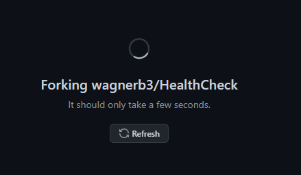
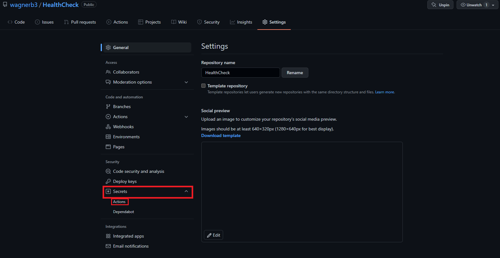
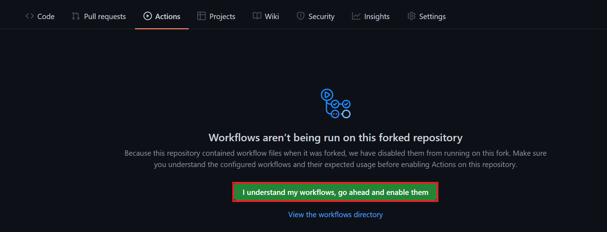

# UDEL Health Checker

This program fills out UDEL's daily health check and generates the green check mark.

## Use
To use this program, you need to be a University of Delaware student or employee. It will also only fill out the form 
as if you do not have COVID-19 or do not have symptoms. If you do have COVID-19 or have symptoms of COVID-19, **DO NOT 
USE THIS PROGRAM**.

To use the program, all you need to do is fork this repository, and add your USERNAME and PASSWORD as repository secrets.
Once that has been done, the health check will automatically be filled out every day at the scheduled time in 
[RunHealthCheck.yaml](.github/workflows/RunHealthCheck.yaml) in [UTC](https://en.wikipedia.org/wiki/Coordinated_Universal_Time). 
If you would like to change the schedule on which the health check is run, look at this 
[scheduling format](https://docs.github.com/en/actions/using-workflows/events-that-trigger-workflows#schedule).

### Forking and Setting Up the Repository

#### Forking
To fork the repository, you will need to click the fork button in the top right corner of this repository home page.

Once you fork the repository, it will create a copy of this repository that you own.

This will bring you to your newly created personal copy of this repository.

#### GitHub Secrets
Once you have a personal copy of this repository, you will need to set up the Secrets for your username and password. To
do this, navigate to the settings tab of your repository.

Once you are at the settings page, you will have to navigate to the Secrets tab on the side navigation bar. The secrets
tab will have 2 options: Actions and Dependabot. Choose Actions. 

This will bring you to the page where you will be able to add secrets. Click the button at the top right that says 
_New Repository Secret_.

That button will bring up a new page where you can name and add a value for a secret.

You will need to add 2 secrets. Create the first and then just repeat these steps to add the second. You will need to 
add secrets for USERNAME and PASSWORD. **THE VALUE THAT YOU PUT IN THE _NAME_ INPUT BAR IS VERY IMPORTANT.** The names
correspond to the values that can be found in the [actions file](.github/workflows/RunHealthCheck.yaml), so they must be
USERNAME and PASSWORD (Yes, all uppercase). The value that needs to be entered for USERNAME is your UDEL username
that you would normally use to log in to fill out the health check. The value that needs to be entered for PASSWORD is 
your UDEL password that you would use with the username that you entered for USERNAME. Once both of those secrets have 
been created, the health check should run at the time scheduled in the [actions file](.github/workflows/RunHealthCheck.yaml).

This is the currently scheduled time: 8:30 UTC or 3:30 AM EST. If you would like to change the time, you may change the time
in [RunHealthCheck.yaml](.github/workflows/RunHealthCheck.yaml). To understand the CRON format, look at this 
[page](https://docs.github.com/en/actions/using-workflows/events-that-trigger-workflows#schedule).

#### Allowing Workflows
Since the new repository is forked, it automatically turns workflows off. Workflows need to be on for the Health Checker
to be run. To do this, you need to navigate to the Actions tab of the repository. On this page, there will be a message 
saying that _Workflows aren’t being run on this forked repository_. There will also be a green button saying _I understand
my workflows, go ahead and enable them_.

You will need to click this green button, which will allow the Health Checker to run.

## Important Notes
 - As stated before, this only completes the health check and generates a green check mark. **DO NOT ABUSE THIS!** Once you
have forked/cloned this repository, it is your responsibility to use it correctly and safely. If you know that you have 
COVID-19, or have come in close contact with somebody that has had COVID-19, please remove the schedule line from 
[RunHealthCheck.yaml](.github/workflows/RunHealthCheck.yaml). If you do not know how to do this, please ask somebody who does. 
If you do not turn the scheduler off, and you generate the green check, please contact the 
[University of Delaware's COVID-19 Division](mailto:coronavirus@udel.edu).
 - If the secrets are not correctly set, the job that is being run will fail, so make sure that they are set correctly.